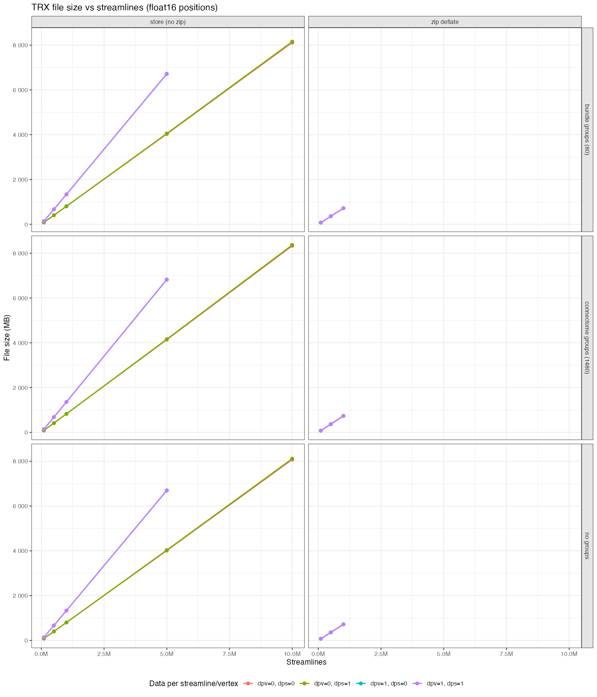
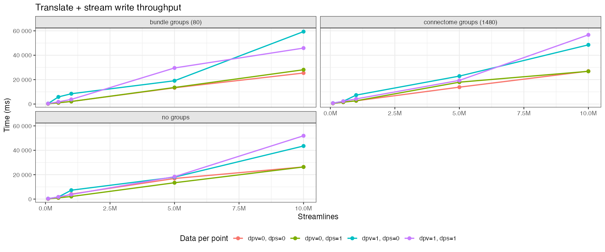
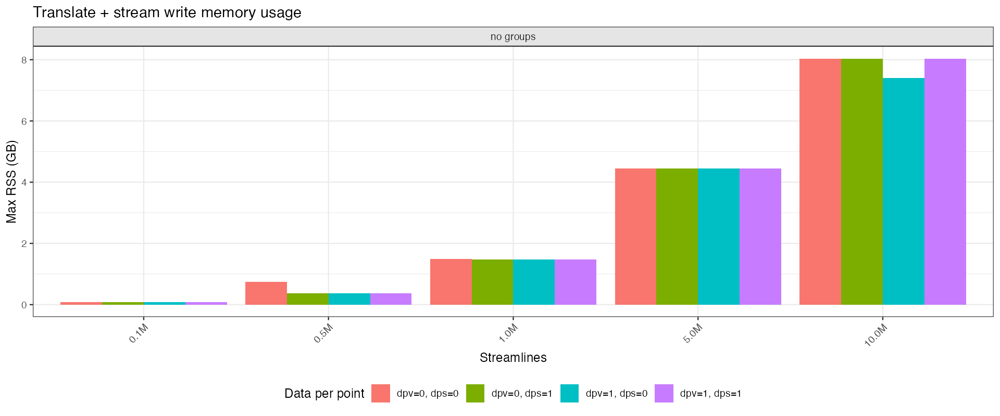

Benchmarks
==========

This page documents the benchmarking suite and how to interpret the results.
The benchmarks are designed for realistic tractography workloads (HPC scale),
not for CI. They focus on file size, throughput, and interactive spatial queries.

Data
----

All benchmarks use a real dataset from the Human Connectome Project (Young Adult dataset).
The original size of the `tck` file is 18.5GB.
The streamlines were generated by `tckgen` and the data per vertex were generated by `tcksift2`.
This data was converted to TRX format (float16 positions) with nibabel.

TRX size vs streamline count
----------------------------

This benchmark creates subsets of the reference TRX file and measures the
on-disk size for different streamline counts. This also calculates the size
with and without additional features such as DPS, DPV and groups.

   File size (MB) as a function of streamline count.

Translate + stream write throughput
-----------------------------------

This benchmark simulates loading a TRX file, applying a spatial transform, and saving it
to a new TRX file (preserving DPV, DPS, groups, etc.). The workflow is:

1. Load the input TRX file (decompresses to a temp directory).
2. Copy all metadata files (header, offsets) and data array directories (``dps``, ``dpv``,
   ``groups``) to a fresh output directory using kernel-level filesystem copies
   (``fcopyfile`` on macOS, ``sendfile`` on Linux). The data never passes through the
   process's mapped address space.
3. Release DPS/DPV mmaps immediately after the copy so their pages are not counted
   against the benchmark's RSS.
4. Iterate through every position point, apply a +1 mm translation in x/y/z, and
   stream the translated positions directly to the output directory.
5. Pack the output directory into a ``.trx`` zip archive using ``zip_source_file``
   (libzip buffered I/O), which reads files in chunks without mapping them into
   the process address space.

The reported ``max_rss_kb`` is the **per-iteration RSS delta** — the peak increase in
resident memory observed during that single iteration, measured with
``mach_task_basic_info`` (macOS) or ``/proc/self/status`` ``VmRSS`` (Linux). This avoids
contamination from previous benchmark iterations whose pages may still be resident.

   End-to-end time for translating and rewriting streamlines.

   Peak RSS delta during translate + stream write. Because DPS/DPV are copied at the
   filesystem level and their mmaps are released before position processing begins, only
   the positions chunk buffer (configurable via ``TRX_BENCH_CHUNK_BYTES``, default 1 GB)
   and the output stream contribute to the measured RSS.

Spatial slab query latency
--------------------------

Streamlines need to be visualized.
One common method for this is to break the tractogram into spatial slabs and query each slab individually.
Both `mrview` and DSI Studio have methods for showing sliced streamlines in 2D.

The `trx-cpp` library provides a few methods for subsetting a large set of streamlines.
This benchmark uses the Axis-aligned bounding box (AABB) method to create subsets of the tractogram.

After computing the AABBs, it issues 20 spatial queries using 5 mm slabs that sweep through the tractogram volume.
Each slab query mimics a GUI slice update and records its timing so distributions can be visualized.
To keep results representative of interactive use, each query returns at most 500 randomly sampled
streamlines from all those intersecting the slab (configurable via ``TRX_BENCH_MAX_QUERY_STREAMLINES``).

.. figure:: _static/benchmarks/trx_query_slab_timings.png
   :alt: Slab query timings
   :align: center

   Distribution of per-slab query latency.

Running the benchmarks
----------------------

Build into ``build-release`` (the default expected by ``run_benchmarks.sh``), then use
the helper script to run all groups and generate plots:

.. code-block:: bash

   cmake -S . -B build-release \
     -DCMAKE_BUILD_TYPE=Release \
     -DTRX_BUILD_BENCHMARKS=ON
   cmake --build build-release --target bench_trx_realdata

   # Run all benchmark groups (filesize, translate+write, query) in sequence.
   ./bench/run_benchmarks.sh --reference /path/to/reference.trx

   # Generate plots into docs/_static/benchmarks.
   Rscript bench/plot_bench.R --bench-dir bench --out-dir docs/_static/benchmarks

``run_benchmarks.sh`` accepts the following flags:

.. list-table::
   :widths: 30 70
   :header-rows: 1

   * - Flag
     - Description
   * - ``--reference PATH``
     - Path to the reference ``.trx`` file (required).
   * - ``--out-dir DIR``
     - Output directory for JSON results (default: ``bench/``).
   * - ``--build-dir DIR``
     - Path to the CMake build directory (default: ``build-release``).
   * - ``--profile core|full``
     - ``core`` (default) skips DPV and compression for large streamline counts to keep
       run time manageable; ``full`` runs every combination.
   * - ``--verbose``
     - Enable per-benchmark progress logging.

Environment variables (set before calling ``run_benchmarks.sh`` or the binary directly):

.. list-table::
   :widths: 35 65
   :header-rows: 1

   * - Variable
     - Description
   * - ``TRX_BENCH_BUFFER_MULTIPLIER``
     - Scale I/O buffer sizes for slow storage (HDD, NFS). Default: ``1``.
   * - ``TRX_BENCH_CHUNK_BYTES``
     - Positions chunk size for translate+write (default: ``1073741824`` = 1 GB).
   * - ``TRX_BENCH_MAX_STREAMLINES``
     - Cap the maximum streamline count tested (default: ``10000000``).
   * - ``TRX_QUERY_TIMINGS_PATH``
     - If set, per-slab query latencies are appended as JSONL to this path.
   * - ``TRX_RSS_SAMPLES_PATH``
     - If set, time-series RSS samples during file-size runs are appended as JSONL.

Example — slower storage with a reduced streamline cap:

.. code-block:: bash

   TRX_BENCH_BUFFER_MULTIPLIER=4 \
   TRX_BENCH_MAX_STREAMLINES=5000000 \
     ./bench/run_benchmarks.sh \
       --reference /path/to/reference.trx \
       --out-dir bench/results_hdd

RSS measurement
~~~~~~~~~~~~~~~

The ``max_rss_kb`` counter in every benchmark reports the **per-iteration RSS delta**:
the maximum increase in resident memory observed during a single benchmark iteration,
sampled at the start and end of each iteration. This avoids contamination from earlier
iterations whose pages may still be resident in the OS page cache.

On macOS the current RSS is read via ``mach_task_basic_info.resident_size``; on Linux
via ``VmRSS`` in ``/proc/self/status``. The ``run_benchmarks.sh`` script runs each
benchmark group (filesize, translate, query) as a separate process to prevent
cross-group RSS accumulation.
